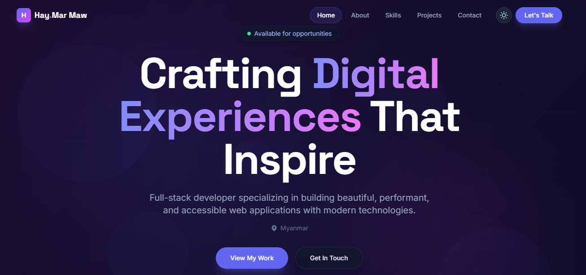

# Hay Mar Maw — Developer Portfolio

> **Live Demo:** [https://hmm-portfolio.vercel.app/](https://hmm-portfolio.vercel.app/)

A modern, animated personal portfolio website built with Next.js 14, Tailwind CSS, and Framer Motion. Features a light/dark theme toggle with glassmorphism, gradient effects, and smooth animations throughout.

<p align="center">
  <a href="https://hmm-portfolio.vercel.app/">
    
  </a>
</p>

## Tech Stack

- **Framework:** Next.js 14 (App Router)
- **Styling:** Tailwind CSS 3.4 with class-based dark mode
- **Theme:** `next-themes` — light/dark toggle with smooth transitions
- **Animations:** Framer Motion 12 — parallax, staggered reveals, floating elements, scroll-triggered animations
- **Icons:** React Icons (Heroicons, Font Awesome 6, Simple Icons)
- **Fonts:** Inter, Space Grotesk, JetBrains Mono (via `next/font/google`)

## Features

- **Light/Dark Theme Toggle** — animated sun/moon icon in the nav bar with smooth 500ms transitions across all elements
- **Glassmorphism** — frosted glass cards in both themes (white translucent in light, dark translucent in dark)
- **Responsive Design** — fully responsive across all breakpoints (mobile, tablet, desktop)
- **Smooth Scrolling** — anchor-based navigation with scroll-aware active states

## Project Structure

```
portfolio/
├── app/
│   ├── globals.css          # Tailwind base + dual-theme utilities
│   ├── layout.js            # Root layout: metadata, fonts, ThemeProvider
│   └── page.js              # Home page: composes all sections
├── components/
│   ├── About.jsx            # Stats, profile, tech bubbles, highlights
│   ├── Contact.jsx          # Contact form and social links
│   ├── FloatingNav.jsx      # Fixed nav with theme toggle
│   ├── Footer.jsx           # Brand, links, social, back-to-top
│   ├── Hero.jsx             # Full-screen hero with aurora background
│   ├── Projects.jsx         # Project cards grid
│   ├── Skills.jsx           # Skill categories with animated bars
│   ├── ThemeProvider.jsx    # next-themes context wrapper
│   └── ThemeToggle.jsx      # Animated sun/moon toggle button
├── public/                  # Static assets
├── tailwind.config.js       # Custom colors, fonts, animations, darkMode
├── next.config.js
├── postcss.config.js
└── package.json
```

## Customization

- **Content:** Edit the constants in each component under `components/` to update stats, skills, projects, and contact info.
- **Colors:** Modify the `primary`, `accent`, `dark`, and `surface` color palettes in `tailwind.config.js`.
- **Theme:** The default theme is dark. Change `defaultTheme` in `components/ThemeProvider.jsx` to `'light'` or `'system'`.
- **Animations:** Custom keyframes (`float`, `pulse-glow`, `shimmer`, `gradient`, `slide-up`, `border-glow`, `aurora`, `morph`) are defined in `tailwind.config.js`.
- **Glassmorphism:** Light and dark glass styles are in `app/globals.css` (`.glass` and `.glass-strong` classes).
- **Gradients:** Aurora background (`.aurora-bg`), gradient text (`.gradient-text`, `.gradient-text-static`), and gradient borders (`.gradient-border`) are in `app/globals.css`.

## License

copyright@ 2026
